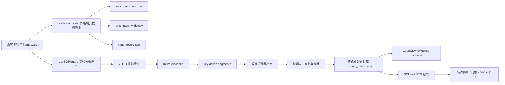
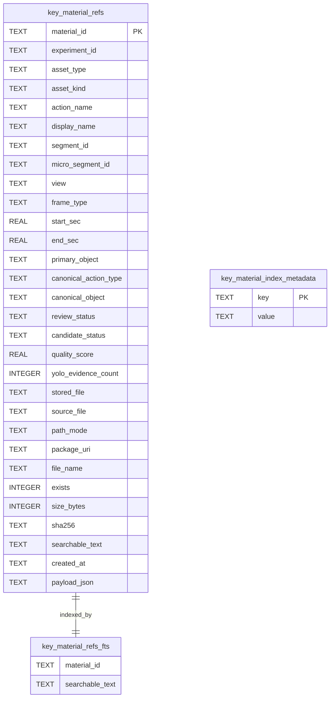

# LabCapability / LabSOPGuard 全流程阶段汇报与下一步方案

生成时间：2026-05-14  
项目路径：`D:\LabCapability`  
当前前端页面：`http://127.0.0.1:5173/experiments/db64d9d2-16ce-4de0-8fb3-597066531c31/materials`

---

## 1. 当前阶段结论

当前工程已经从“能跑通实验分析”推进到“可索引、可审核、可同步正式库、可生成 OpenClaw evidence package、可查看真实耗时、可进行多相机 frames.csv 元数据同步”的阶段。

但从用户前端人工复核结果看，动作语义准确率仍然存在明显问题，尤其是 `bottle / paper / spatula / balance` 之间的交互对象混淆。下一阶段重点不应继续堆叠产物，而应围绕“动作判断准确率”和“审核闭环”做质量提升。

---

## 2. 当前已实现能力

### 2.1 全流程实验分析链路

当前实验 ID：`db64d9d2-16ce-4de0-8fb3-597066531c31`

实验输出目录：

```text
D:\LabCapability\LabSOPGuard\outputs\experiments\db64d9d2-16ce-4de0-8fb3-597066531c31
```

当前实验状态：

```text
status: completed
message: Key-action pipeline completed; quality gate passed and delivery package is ready
```

前端材料页候选库已恢复完整：

```text
候选组 total: 17
候选文件 file_total: 71
pending: 28
approved: 26
rejected: 8
not_selected: 9
```

正式关键素材库已同步：

```text
正式素材数量: 26
关键帧: 14
关键片段: 12
OpenClaw evidence package: passed
```

---

### 2.2 真实耗时展示

当前前端 `/timing` 已能返回真实总耗时，不只是进度条。

当前实验真实全流程耗时：

```text
total_sec: 351.196s
core_analysis_sec: 155.756s
detection: 109.265s
micro_segmentation: 44.575s
vector_index: 1.873s
```

说明：

- `total_sec` 是旧实验从任务开始到完成的端到端耗时。
- `core_analysis_sec` 是核心分析阶段耗时。
- `detection` 是 YOLO 检测阶段耗时。
- `micro_segmentation` 是微片段生成耗时。
- `vector_index` 是向量索引阶段耗时。

---

### 2.3 候选素材审核闭环

当前候选审核逻辑已经回归到正式关键素材库页面中，而不是单独作为孤立菜单存在。

审核通过后的自动产物包括：

```text
material_references/
  关键帧/
  关键片段/
  专业报告/
  素材索引.json
  素材索引.jsonl
  key_material_references.sqlite
  evidence_package_manifest.json
  physical_change_log.jsonl
  time_alignment.json
  README.md
```

也就是说，候选素材经过前端批准后，会进入正式 `material_references` 文件夹，并同步生成 OpenClaw 可读素材证据包。

---

### 2.4 YOLO 标注框逻辑修复

之前问题：

人工把候选从 `bottle` 改成 `paper / spatula / balance` 后，系统仍可能使用旧的 `yolo_recheck.primary_object` 或旧 cached `hand_object_interactions` 来画框，导致候选库和正式库中的框标错对象。

已修复逻辑：

```text
人工校正后的对象 canonical_object / primary_object / secondary_objects
        ↓
重新选择同 micro + view 中真正含目标 hand-object interaction 的 evidence row
        ↓
如 cached interaction 不支持目标对象，则从 detections 重新计算 hand-object interaction
        ↓
只画 hand + 目标对象
        ↓
如果找不到目标交互，不再硬画错误框，而是记录 rerender_error
```

当前重渲染结果：

```text
候选总数: 71
带人工校正或目标过滤的候选: 48
可成功渲染目标交互框: 53
无法找到可靠 hand-target 证据: 18
```

这意味着系统现在不会再为了“看起来有框”而硬画错误对象。没有可靠证据的素材会留下诊断信息。

---

### 2.5 VLM disabled 根因

结论：不是没有 token。

根因是：

```text
D:\LabCapability\LabSOPGuard\.env
```

原配置为：

```text
KEY_ACTION_ENABLE_VLM_ASSIST=0
```

因此旧实验运行时 VLM 被显式关闭。

已修复为：

```text
KEY_ACTION_ENABLE_VLM_ASSIST=1
```

当前诊断结果：

```text
enabled: True
configured: True
api_key_configured: True
dashscope_installed: True
model: qwen3.6-plus
```

注意：

旧实验的 `job_status.json` 仍然记录历史运行时状态 `VLM disabled`，这是历史事实，不会自动被新配置改写。下一次重新跑新实验时，才会真正启用 VLM-assisted 候选复核。

---

## 3. RealityLoop 多相机 frames.csv 同步 pipeline

### 3.1 新增包

新增独立包：

```text
D:\LabCapability\src\realityloop_sync
```

结构：

```text
src/realityloop_sync/
  __init__.py
  cli.py
  config.py
  discover.py
  frames.py
  manifest.py
  report.py
  sync.py
```

能力：

- 支持 YAML 配置。
- 支持 N 路相机。
- 支持 `reference_camera`。
- 支持 `timestamp.preferred_cols`，timestamp 字段不硬编码。
- 支持 `tolerance_us`。
- 支持 manifest/mapping table 预留。
- 支持 `filters`，例如只同步 `stream_type=rgb`。
- 不读取视频像素。
- 不修改原始相机目录。
- 输出全部写入配置指定的 `output_dir`。

CLI：

```powershell
realityloop-sync inspect --config configs/realityloop_example.yaml
realityloop-sync run --config configs/realityloop_example.yaml
realityloop-sync build-manifest --root <video_database_root> --date <YYYY-MM-DD> --start-time <HHMMSS> --output manifest.csv
```

---

### 3.2 真实本地数据实测

用户提供真实路径：

```text
C:\Users\Xx7\Desktop\windows-dev-01_cam01
C:\Users\Xx7\Desktop\windows-dev-01_cam02
```

实际 run 目录：

```text
C:\Users\Xx7\Desktop\windows-dev-01_cam01\2026-05-13\182744
C:\Users\Xx7\Desktop\windows-dev-01_cam02\2026-05-13\182744
```

配置文件：

```text
D:\LabCapability\configs\realityloop_windows_dev_01_20260513_182744.yaml
```

输出目录：

```text
D:\LabCapability\outputs\realityloop_sync\windows_dev_01_20260513_182744
```

真实同步耗时：

```text
2.935s
```

输出大小：

```text
files: 4
total: 5.176 MB
```

输出文件：

```text
sync_pairs_long.csv    3.78 MB
sync_pairs_wide.csv    1.64 MB
sync_report.json       985 B
run_summary.md         621 B
```

同步质量：

```text
reference_camera: cam01
timestamp_col_used: packet_system_timestamp_us
cam01 RGB frames: 24070
cam02 RGB frames: 21453
match_rate cam01: 1.0
match_rate cam02: 1.0
median_abs_time_diff_us cam02: 15163
p95_abs_time_diff_us cam02: 29752.55
max_abs_time_diff_us cam02: 282547
warnings: []
```

---

## 4. 技术架构图



---

## 5. 文件结构图

```text
D:\LabCapability
  configs\
    realityloop_example.yaml
    realityloop_windows_dev_01_20260513_182744.yaml

  src\
    realityloop_sync\
      __init__.py
      cli.py
      config.py
      discover.py
      frames.py
      manifest.py
      report.py
      sync.py

    key_action_indexer\
      material_references.py
      evidence_package.py
      material_reference_index.py
      frontend_sync.py

  LabSOPGuard\
    backend\
      main.py
    frontend-app\
    outputs\
      experiments\
        db64d9d2-16ce-4de0-8fb3-597066531c31\
          _material_review_queue\
          material_references\
          key_action_index\

  outputs\
    realityloop_sync\
      windows_dev_01_20260513_182744\
        sync_pairs_long.csv
        sync_pairs_wide.csv
        sync_report.json
        run_summary.md
```

---

## 6. 数据库结构图

当前正式素材 SQLite：

```text
D:\LabCapability\LabSOPGuard\outputs\experiments\db64d9d2-16ce-4de0-8fb3-597066531c31\material_references\key_material_references.sqlite
```

核心表：



当前数据量：

```text
key_material_refs rows: 26
key_material_refs_fts rows: 26
key_material_index_metadata rows: 5
```

---

## 7. 真实问题清单

### 问题 1：动作分类仍然不够稳

表现：

- `hand-bottle` 被误判成 bottle，但实际可能是 paper 或 spatula。
- `hand-paper` 被误判成 paper，但实际可能是 balance 或 spatula。
- 多对象动作无法完整表达，例如“手与试剂瓶 + 药匙操作”。

根因：

- 单纯依赖 YOLO proximity 或局部 hand-object interaction 不足。
- 当前动作标签更像单目标分类，不能充分表达实验动作的多对象语义。

解决方向：

- 启用 VLM 复核。
- 增加多对象动作类型。
- 引入连续时间窗口判断，而不是只看单帧。

---

### 问题 2：部分候选关键帧没有可靠目标框

当前结果：

```text
18 条候选没有可靠 hand-target evidence
```

这类素材现在不会再硬画错框，而是记录 `rerender_error`。

后续应在前端明确显示：

```text
no_target_box
no_hand_target_interaction_evidence
no_hand_target_interaction_boxes
```

让用户知道这是“证据不足”，不是系统静默失败。

---

### 问题 3：旧实验 VLM 没参与

旧实验运行时配置为：

```text
KEY_ACTION_ENABLE_VLM_ASSIST=0
```

因此当前旧实验里的 `vlm_semantics.status=disabled` 是历史运行结果。

现在已经修复配置，但必须重新跑新实验才能看到 VLM-assisted 结果。

---

### 问题 4：frames.csv 混合 depth/rgb

真实 `frames.csv` 中包含：

```text
stream_type=depth
stream_type=rgb
```

如果不先过滤，会产生大量重复 timestamp，污染同步质量报告。

已新增：

```yaml
filters:
  stream_type: rgb
```

---

### 问题 5：真实相机同步仍有峰值时间差

cam02 相对 cam01：

```text
median_abs_time_diff_us: 15163
p95_abs_time_diff_us: 29752.55
max_abs_time_diff_us: 282547
```

说明存在掉帧、采样频率差异或采集端时间抖动。

后续建议设置 `tolerance_us`，例如：

```yaml
tolerance_us: 50000
```

超过阈值的匹配应标记为 unmatched。

---

### 问题 6：飞书机器人闭环尚未完成

当前已经具备：

- JSONL 索引
- SQLite + FTS 检索
- OpenClaw evidence package
- 正式关键素材库
- 动作 metadata

但尚未真正完成：

```text
飞书机器人收到 JSON → 自动索引 → 判断动作 → 返回答案
```

下一步需要补 webhook / adapter 层。

---

## 8. 下一步详细方案

### P0：重新跑一个启用 VLM 的新实验

目标：验证 VLM 是否能降低 paper / bottle / spatula / balance 混淆。

步骤：

1. 使用当前 `.env`：

```text
KEY_ACTION_ENABLE_VLM_ASSIST=1
```

2. 重新创建实验并跑完整分析。
3. 输出 VLM-assisted 候选结果。
4. 对比旧实验：

```text
YOLO-only 候选准确率
YOLO+VLM 候选准确率
误判数量
no_target_box 数量
总耗时变化
```

验收标准：

```text
瓶/纸/药匙/天平的误判明显下降
候选素材中的 VLM 状态不再是 disabled
候选页能解释每个低置信素材的原因
```

---

### P0：前端显示素材证据状态

当前用户看到“没有框”时不清楚是漏了还是证据不足。

应新增前端字段展示：

```text
yolo_annotation_rendered: true / false
rerender_error
box_filter
canonical_object
secondary_objects
vlm_semantics.status
```

展示方式：

```text
绿色：目标框已渲染
黄色：证据不足，需要人工复核
红色：疑似动作判断错误
灰色：VLM 未参与或该候选未复核
```

---

### P1：多对象动作标签体系

新增或规范动作类型：

```text
hand-paper
hand-balance
hand-spatula
hand-bottle
hand-paper+balance
hand-bottle+spatula
hand-paper+spatula
```

候选素材需要支持：

```json
{
  "canonical_action_type": "hand-bottle+spatula",
  "canonical_object": "bottle",
  "secondary_objects": ["spatula"],
  "secondary_actions": ["hand-spatula"]
}
```

判断逻辑：

- 主对象决定主动作。
- 次对象补充动作上下文。
- 检索时主次对象都可召回。

---

### P1：动作判断由单帧升级为时间窗口

当前误判很多来自单帧或短时 proximity。

应改成窗口级规则：

```text
micro window 内连续 N 帧出现 hand-target interaction
且目标对象位置/动作趋势一致
且不被更强交互对象覆盖
才确认动作标签
```

示例：

```text
如果 hand-paper 和 hand-balance 同时出现：
  paper 是被移动对象
  balance 是承载/称量设备
  动作应标记为 hand-paper+balance，而不是只标 hand-paper
```

---

### P1：RealityLoop 同步接入主实验 manifest

当前 `realityloop_sync` 已独立跑通。

下一步：

1. 将 `sync_report.json` 写入实验 manifest。
2. 前端概览页显示：

```text
相机数量
参考相机
同步字段
帧数量
match_rate
median / p95 / max time diff
warnings
```

3. 当 `max_abs_time_diff_us` 超阈值时提醒：

```text
双视角同步质量存在风险，请检查采集端掉帧或时间戳字段。
```

---

### P1：飞书机器人 JSON 闭环

目标：用户直接发 JSON，机器人能完成索引、判断和回答。

建议流程：

```text
飞书 webhook
  ↓
JSON schema 校验
  ↓
定位 experiment_id / material package
  ↓
读取 key_material_references.sqlite 或 jsonl
  ↓
执行检索 / 动作判断
  ↓
返回证据化回答
```

返回内容：

```text
实验类型判断
关键动作结论
引用的关键帧/关键片段
证据路径
置信度
不确定项
需要人工确认的点
```

---

## 9. 建议优先级

```text
P0 重新跑启用 VLM 的新实验
P0 前端展示 no_target_box / rerender_error / VLM 状态
P1 多对象动作标签体系
P1 时间窗口级动作判断
P1 sync_report 接入实验概览页
P1 飞书机器人 JSON → 索引 → 判断 → 回答
P2 tolerance_us 同步质量门控
P2 候选准确率评估报告自动生成
```

---

## 10. 当前验证情况

已执行验证：

```text
pytest 相关回归: 28 passed
frontend npm run build: passed
python -m compileall src\realityloop_sync: passed
真实 frames.csv 同步: passed, 2.935s
后端服务: running, PID 282596
前端服务: running, PID 24256
```

---

## 11. 最终判断

当前系统已经具备工程闭环雏形：

```text
实验视频 → YOLO/micro evidence → 候选素材 → 人工审核 → 正式素材库 → evidence package → SQLite/FTS 检索 → 前端查看真实耗时与素材证据
```

但距离“稳定自动判断实验动作”还有两个核心短板：

1. 动作语义需要 VLM + 多对象规则增强。
2. 候选素材质量状态需要在前端显式展示，避免用户把证据不足误解为系统漏检。

下一步建议优先重跑一个启用 VLM 的真实实验，用实际候选准确率验证增强效果。
